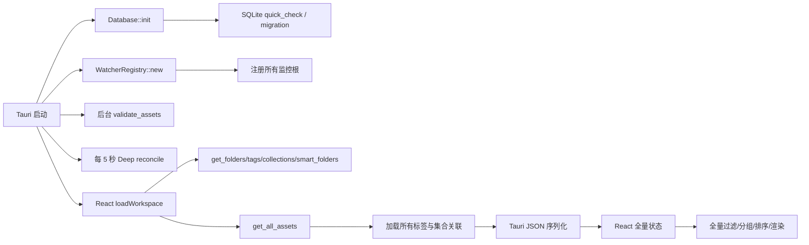
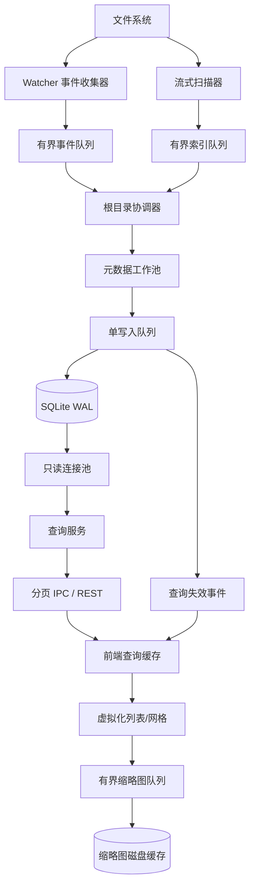

# Asset Explorer 百万级资产数据架构与全面性能优化设计

> 日期：2026-09-09
> 状态：设计已确认；2026-09-09 补充确认采用全新 V2 空库启动，不保留旧数据兼容
> 适用范围：Tauri 桌面端、本地 SQLite 数据层、文件扫描与实时监控、缩略图与预览、React 界面，以及 Web/PostgreSQL 路径的语义对齐

## 1. 执行摘要

Asset Explorer 当前在数千文件下已经出现启动后空工作区、后台校验等待、界面长期不显示等问题；在几十万文件和几十 GB 单文件场景下，会进一步出现扫描时间不可控、内存快速增长、数据库互斥等待、事件线程爆炸、前端长任务和进程崩溃。

问题不是单一的“启动校验太慢”，而是当前架构在每一层都采用了全量数据模型：

1. 文件系统被频繁整树递归扫描。
2. SQLite 查询把全部资产及关联关系加载进 Rust 内存。
3. Tauri IPC 一次性序列化和传输全部对象。
4. React 把全部资产保存在单一状态中，再进行全量过滤、分组、排序和选择判断。
5. 缩略图、预览和元数据提取缺少全局资源预算，可能把大文件或大图完整读入内存。
6. 文件监控事件与“兜底对账”并行工作，但没有单航班、去重、取消和背压机制。

本设计保留 SQLite 作为桌面端本地索引和用户数据存储，不替换数据库引擎；核心改造是将系统从“全量快照驱动”转为“数据库查询驱动 + 流式索引 + 有界任务 + 增量失效通知”。项目仍处于初始开发期，用户已明确现有数据均可重建，因此实现采用全新的 V2 数据库和接口，不承担旧数据库、旧表结构、旧全量 IPC 接口或旧前端状态的兼容责任。

最终目标：即使资产库达到 100 万文件，前端也只接收当前可见的 100～300 条记录；即使单文件达到 50GB，后台也只读取必要的固定大小文件头或使用流式协议；任何事件风暴、批量复制、目录重命名和缩略图请求都被有限队列约束，不再无限占用线程、内存或磁盘 I/O。

## 2. 目标、边界与性能基线

### 2.1 目标设备与数据规模

- Windows 10/11。
- 4～8 核 CPU、16GB 内存、SSD；机械硬盘仍可运行，但不承诺相同性能。
- 单个工作区最多 100 万资产、10 万文件夹。
- 单个文件最大 50GB；系统设计不得因文件大小线性增加内存占用。
- 支持多个监控根目录以及离线磁盘、网络盘短暂断开等异常场景。

### 2.2 建议验收指标

| 场景 | 目标 |
|---|---:|
| 冷启动到窗口可操作 | ≤ 2 秒，不等待磁盘校验或全量扫描 |
| 首屏资产查询 | P95 ≤ 150ms，首屏 100～200 条 |
| 翻页/虚拟滚动查询 | P95 ≤ 120ms |
| 普通文件新增、删除、修改到界面可见 | P95 ≤ 1 秒 |
| 10,000 个事件突发 | 无崩溃、无无限线程增长，最终一致 |
| 空闲内存 | ≤ 800MB |
| 百万级扫描峰值内存 | ≤ 1.5GB，且不随单文件大小线性增长 |
| 50GB 文件建档 | 不读取完整内容，常规元数据阶段 ≤ 1 秒进入索引队列 |
| 中断恢复 | 重启后继续未完成扫描，不重新处理已提交批次 |
| 用户标记可靠性 | 文件刷新、改名、重新扫描不得覆盖评分/收藏/颜色/标签/集合 |

这些指标应通过固定数据集和自动化基准测试验证，而不是仅凭开发机主观感受判断。

### 2.3 非目标

- 第一阶段不引入 Elasticsearch、Redis、RocksDB 或常驻独立服务。
- 不在首轮重构中实现文件内容全文索引。
- 不保证所有第三方私有格式都能生成预览；无法安全解码时应显示文件类型占位图。
- 不以“每次全盘扫描绝对实时”作为正确性手段；正确性由事件日志、局部修复和低优先级恢复任务共同保证。
- 不迁移旧 `assethub.db` 的资产、标记或关联数据；V2 从空库开始，由文件系统重新建立索引。
- 不保留旧 `load_workspace`、全量 `assets[]` 和旧扫描结果协议作为运行时兼容层。

### 2.4 已确认的全新启动策略

- V2 默认使用独立文件 `assethub-v2.db`，避免覆盖旧数据库，旧文件仅作为人工回退材料保留。
- V2 首次启动创建最新 schema，不执行旧 schema 的逐版本迁移。
- 用户重新添加监控根目录后，由流式扫描重建所有文件事实和可重建索引。
- 标签、集合、评分、收藏等用户数据从空白开始，不从旧库导入。
- 开发阶段如 V2 schema 发生不兼容变化，允许显式提高 schema epoch 并创建新空库；禁止静默删除正在使用的库。

## 3. 当前系统事实模型

### 3.1 桌面端启动数据流

当前主要链路如下：



关键实现位置：

- `src-tauri/src/main.rs`：数据库初始化、监控器启动、5 秒周期对账、后台资产校验、窗口聚焦对账。
- `src-tauri/src/commands.rs::load_workspace`：工作区初始化 IPC。
- `src-tauri/src/database.rs::get_all_assets`：全部资产和关联关系装载。
- `src/hooks/useAppState.ts`：前端全量工作区状态初始化。
- `src/hooks/useAssetFiltering.ts`：前端内存过滤。
- `src/components/MainArea.tsx`：分组、排序与资产节点构造。

启动校验虽然已被移动到后台，仍会读取全资产集合并逐个访问文件系统；它会和首屏查询、周期对账、监控写入争用同一个 SQLite 连接和磁盘，因此“不阻塞 UI 线程”并不等于“不阻塞用户看到内容”。

### 3.2 初始扫描数据流

当前 `indexer.rs` 先把全部目录和文件路径收集到 `Vec`，随后并行提取元数据。所谓增量扫描虽然会按批写入和发送事件，但函数内部仍保留并返回完整资产数组。

实际存在多份同时存活的数据：

- 全部路径 `PathBuf` 集合。
- Rust `Asset` 对象集合。
- 数据库事务绑定值和查询结果。
- Tauri 序列化缓冲。
- JavaScript 对象集合。
- React 过滤、分组、排序产生的派生集合。

因此内存复杂度仍然是 O(N)，且常数很大。几十万文件时，即使单条记录只占几百字节，也会因字符串、对象头、哈希表和序列化副本快速膨胀。

### 3.3 实时监控与对账流

当前监控流程存在以下事实：

- `watcher.rs` 使用无界通道接收文件系统事件。
- 事件按时间和数量聚合，但批次完成后仍可能对受影响监控根执行完整 `Deep` 对账。
- `trigger_reconcile` 可为事件创建新的 OS 线程，没有“同一根目录只允许一个对账任务”的约束。
- `main.rs` 每 5 秒对每个监控根执行一次 `Deep` 对账。
- 窗口聚焦会从 Rust 端触发 `Pruned` 对账，前端聚焦监听还可能再次调用对账命令。
- `sync.rs::reconcile_root` 当前忽略 `ReconcileMode` 参数；`Pruned` 和 `Deep` 都递归遍历完整目录树。
- 对账将所有磁盘目录和文件装入两个完整 `HashMap` 后再比较。
- `get_asset_signatures_under` 先读取全数据库资产，再在 Rust 中按路径过滤。

因此修改一个普通文件，可能形成如下放大链：

```text
1 个文件事件
→ 事件快速处理
→ 整个根目录扫描
→ 全库资产签名读取
→ 文件系统与 SQLite 争用
→ 增量事件推送
→ React 全量数组重建
```

### 3.4 SQLite 存储与并发模型

当前数据库主体是 `Arc<parking_lot::Mutex<rusqlite::Connection>>`。虽然启用了 WAL，但所有命令仍需争用一个连接锁：

- 长查询阻塞写入。
- 大批量写入阻塞首屏读取。
- 后台校验、对账、缩略图 URL 更新和用户标记互相排队。
- WAL 的多读单写优势没有被实际利用。

路径查询中存在 `lower(replace(path, ...))` 形式的运行时规范化表达式，普通 `path` 索引无法有效参与；在监控批次中逐文件调用时，会退化为大量扫描。

现有 FTS 触发器会在资产任意 `UPDATE` 时删除并重建全文索引项，包括仅修改缩略图、评分或收藏等与搜索文本无关的字段。

还存在两类正确性风险：

1. 新扫描资产使用通用 UPSERT 更新时，会把 `date_added`、`rating`、`favorite`、`color`、`thumbnail_url` 等字段覆盖为扫描默认值。
2. `delete_assets_by_prefix` 在持有数据库互斥锁期间再次调用需要同一把锁的方法，存在自锁死风险。

### 3.5 前端读取与显示模型

前端当前将 `assets`、`folders`、标签、集合等全部保存在一个 `AssetState`：

- 搜索和智能文件夹主要在前端过滤完整数组。
- 文件夹分组会遍历和排序全部筛选结果。
- 主视图虽然限制最终显示的文件夹组数和每组卡片数，但限制发生在全量计算之后。
- 双栏监控视图会反复扫描文件夹和资产数组，并直接映射所有匹配资产。
- 选择判断多处使用数组 `.some()`/`.includes()`；大量选择时复杂度显著放大。
- “全选”会创建所有资产的选择对象。
- 乐观更新通常映射整个资产数组；失败多为日志记录，没有统一回滚和错误状态。
- 部分移动/路径调整只修改前端状态，重启后不能恢复。

CSS `content-visibility` 可以减少绘制成本，但不能减少对象创建、React 协调、全量排序和数据传输成本，因此不是百万级数据方案。

### 3.6 缩略图与大文件预览

当前预览路径对部分文件调用 `read_file_base64`。即使设置 50MB 上限，也会产生：

- Rust 字节缓冲。
- Base64 约 33% 的体积膨胀。
- IPC JSON/字符串副本。
- JavaScript 字符串和 Blob 副本。

几十 MB 文件就可能形成上百 MB 的瞬时内存峰值。50GB 文件虽然会被拒绝，但错误处理、回退或第三方预览组件仍可能触发不安全行为。

缩略图层还存在：

- 全局 JavaScript Map 没有容量和淘汰策略。
- 每个已挂载卡片都可能触发 `file_exists` 和缩略图 IPC。
- 缺少全局并发调度和取消机制。
- 图片回退解码可能把原图完整展开；超高分辨率或压缩炸弹图片会消耗巨量内存。
- 缓存键仅与路径和尺寸有关，源文件修改后可能继续使用旧缩略图。

### 3.7 Web/PostgreSQL 路径

Web 路径也使用全工作区接口返回全部资产和关联关系，缺少一致的游标分页与查询协议。部分标签/集合批处理会在 JavaScript 内构造笛卡尔积并逐条写入；桌面端与 Web 端对评分、收藏等操作的语义不完全一致。

因此目标架构应先定义统一领域协议，再由 SQLite 和 PostgreSQL 分别实现，而不是维护两套行为不同的界面逻辑。

## 4. 根因与优先级

| 优先级 | 根因 | 复杂度/风险 | 用户表现 |
|---|---|---|---|
| P0 | 每 5 秒整根递归对账，且 Pruned 模式未实现 | O(根目录总文件数 × 根数 × 时间) | 持续磁盘占用、卡顿、风扇高转 |
| P0 | 事件触发无界对账线程与无界事件队列 | 无明确上限 | 批量复制时线程、内存、I/O 失控 |
| P0 | 单 SQLite 连接全局互斥 | 长任务串行放大 | 首屏、标记、监控写入互相堵塞 |
| P0 | 全量工作区装载和 IPC 传输 | O(N) 内存和序列化 | 启动空白、长时间无内容、崩溃 |
| P0 | 前端全量状态和非虚拟渲染 | O(N)～O(N²) | 页面冻结、选择/筛选明显延迟 |
| P0 | 文件系统更新覆盖用户字段 | 数据丢失 | 评分、收藏和颜色被重置 |
| P0 | 路径前缀删除潜在自锁死 | 永久等待 | 目录删除后程序挂死 |
| P1 | 大文件 Base64 与完整图片解码 | 内存与文件大小/像素数相关 | 预览时内存暴涨或崩溃 |
| P1 | 缩略图无并发与缓存预算 | 无界任务和内存 | 快速滚动时卡顿、崩溃 |
| P1 | 路径查询无法利用索引 | 逐事件扫描 | 事件越多越慢 |
| P1 | 用户修改缺少统一事务/回滚 | 状态分裂 | UI 与 DB 不一致 |
| P2 | 桌面/Web 协议语义不一致 | 长期维护风险 | 同一功能行为不同 |

## 5. 目标架构

### 5.1 核心原则

1. **数据库查询驱动界面**：前端永远不持有完整资产库。
2. **有界资源**：所有队列、线程池、批次、缓存和预览读取均有硬上限。
3. **增量优先**：文件事件只处理最小影响范围；全量扫描是显式恢复操作。
4. **用户数据与文件数据分离**：文件系统刷新不得覆盖用户标记。
5. **可恢复任务**：扫描和对账是可记录、可取消、可继续的作业。
6. **版本化查询**：事件只通知“哪些查询失效”，不向前端广播大量完整资产对象。
7. **先可见后完整**：首屏和基础元数据优先，昂贵工作延迟处理。
8. **可测量**：每个阶段记录队列深度、耗时、吞吐、内存和失败原因。

### 5.2 逻辑架构



### 5.3 三类状态明确分离

| 状态 | 真相源 | 示例 |
|---|---|---|
| 文件事实 | 文件系统 | 路径、大小、mtime、文件 ID、存在性 |
| 可重建索引 | SQLite | MIME、宽高、缩略图版本、搜索文本、扫描状态 |
| 用户数据 | SQLite，需要备份 | 评分、收藏、颜色、标签、集合、自定义名称、备注 |

文件事实和可重建索引可以重新扫描；用户数据不能因重新扫描丢失。数据库 API 必须按字段所有权分别更新。

## 6. 本地数据存储设计

### 6.1 连接与事务模型

SQLite 继续使用 WAL，但改为：

- 一个专用写连接，由单写入任务串行消费 `DbWriteBatch`。
- 2～4 个只读连接组成有界连接池，设置合理的 `busy_timeout`。
- UI 查询只使用只读连接，不被文件 I/O 或元数据提取占用。
- 写批次建议 200～1,000 条或 20～50ms 提交一次，以先到条件为准。
- 任何文件系统访问和图片解码都在进入数据库事务前完成。
- 事务仅包含数据库操作，不持有锁等待 IPC、文件系统或事件发送。

建议 PRAGMA：

- `journal_mode=WAL`
- `synchronous=NORMAL`
- `foreign_keys=ON`
- `busy_timeout=5000`
- `temp_store=MEMORY`
- 依据设备内存设置负值 `cache_size`，例如 64～128MB，而不是无限增长
- 定期低优先级 `wal_checkpoint(PASSIVE)`；退出时再执行可控检查点

### 6.2 路径与身份模型

仅以路径哈希作为资产 ID 会让改名等同删除再新增，并使用户标记难以可靠继承。建议增加：

- `normalized_path`：统一分隔符、盘符大小写、尾部分隔符后的路径；建立唯一索引。
- `parent_path` 或 `folder_id` 索引。
- `volume_id + file_id`：Windows 可获取时作为稳定文件身份；获取失败时回退到路径。
- `path_hash`：用于快速等值定位，不作为唯一事实来源。
- `source_version`：由 `mtime_ns + size` 组成；必要时附带快速指纹。
- `record_version`：每次 DB 更新递增，用于前端增量刷新和乐观并发。

目录使用同样的 `normalized_path` 和稳定文件 ID。所有路径等值查询必须直接命中规范化列，禁止在 WHERE 条件中对整列执行 `lower/replace`。

### 6.3 建议表结构调整

V2 直接创建最终表结构，不为旧表编写迁移。后续 V2 内部的小版本升级仍使用明确 schema version 管理：

#### `assets`

- 文件字段：`id`、`folder_id`、`path`、`normalized_path`、`name`、`extension`、`type`、`mime`、`size`、`mtime_ns`、`volume_id`、`file_id`。
- 索引字段：`width`、`height`、`duration_ms`、`metadata_status`、`thumbnail_status`、`thumbnail_version`、`search_text`。
- 用户字段不放在 `assets` 中，直接存入 `asset_user_state`；文件扫描 UPSERT 从结构上无法覆盖用户标记。
- 生命周期字段：`first_seen_at`、`last_seen_generation`、`deleted_at`、`record_version`。

#### `asset_user_state`

- `asset_id` 主键。
- `rating`、`favorite`、`color`、`custom_name`、`notes`、`updated_at`。

#### `scan_jobs`

- `id`、`root_id`、`kind`、`state`、`generation`、`cursor/path checkpoint`。
- `discovered_count`、`indexed_count`、`failed_count`、`started_at`、`updated_at`、`error`。

#### `file_event_journal`

- 短期保存尚未提交的合并事件：`root_id`、`normalized_path`、`event_kind`、`observed_at`。
- 写入提交后按水位清理，异常退出后可恢复。

#### `asset_errors`

- 保存无法读取、权限不足、解码失败等信息，而不是使整个扫描失败。
- 使用 `(asset_id, stage)` 唯一键，成功后清除。

#### `folder_stats` / `tag_stats` / `collection_stats`

- 保存直接数量和递归数量；由写入事务增量维护或后台重算。
- 界面不再对完整资产数组执行 COUNT。

### 6.4 索引建议

- `UNIQUE(normalized_path)`。
- `(folder_id, sort_key, id)`：按名称、修改时间、大小分别建立覆盖场景索引。
- `(type, date_modified, id)`。
- `asset_user_state(favorite, rating, asset_id)`。
- 关联表保持复合主键 `(asset_id, tag_id)`、`(asset_id, collection_id)`，并增加反向索引 `(tag_id, asset_id)`、`(collection_id, asset_id)`。
- 文件夹 `(parent_id, name)`、`normalized_path` 索引。
- FTS 触发器只在名称、路径、用户文本等搜索字段变化时更新，缩略图和评分更新不能重建 FTS。

## 7. 流式扫描与文件处理

### 7.1 扫描状态机

```text
Created → Discovering → Indexing → Finalizing → Completed
                         ↓              ↓
                       Paused         Failed
                         ↓              ↓
                       Resuming ←──── Retry
```

每个监控根同一时刻只能有一个结构扫描任务。重复请求合并为一个“需要再次检查”标志，不创建新线程。

### 7.2 流式流水线

1. **发现阶段**：遍历器逐条输出路径，不收集完整路径列表。
2. **轻量 stat 阶段**：获取类型、大小、mtime、稳定文件 ID；目录优先写入。
3. **差异判定**：与数据库签名批量比较，未变化记录直接跳过。
4. **基础建档**：批量 UPSERT 文件事实，马上可被界面查询。
5. **延迟元数据**：仅对需要的格式进入有限工作池。
6. **延迟缩略图**：由可见性和优先级触发，不在全量扫描阶段强制生成。
7. **完成标记**：使用扫描代次删除本轮未见且确认根目录在线的旧记录。

队列必须有容量，例如：

- 发现 → stat：4,096 路径。
- stat → DB：1,000 记录。
- 元数据任务：CPU 核数的一半，通常 2～4 个。
- 缩略图任务：HDD 1～2 个、SSD 2～4 个；由配置和观测调整。

队列满时上游等待，形成背压，禁止继续累积内存。

### 7.3 扫描代次避免全量内存对账

为每次扫描生成 `generation`：

1. 扫描看到文件时写入 `last_seen_generation = current_generation`。
2. 扫描正常完成后，数据库直接删除/软删除该根目录中 `last_seen_generation < current_generation` 的记录。
3. 扫描被取消、磁盘离线或发生权限错误时，不执行缺失清理。

这样无需同时在内存维护“磁盘所有路径”和“数据库所有路径”两个 HashMap。

### 7.4 文件类型与深度读取策略

将处理拆为等级：

- L0：`stat`，所有文件执行；不读取内容。
- L1：读取最多 4～64KB 文件头，用于魔数、基础格式识别。
- L2：按格式读取必要结构，如图片尺寸、媒体容器目录；必须使用可 seek 的流。
- L3：缩略图/波形/模型预览；仅按用户可见性和后台空闲触发。
- L4：完整哈希；默认禁用，只在用户明确查重或校验时执行，并流式读取、低优先级限速。

任何解析器必须有最大耗时、最大像素、最大解压尺寸、取消令牌和 panic 隔离。

## 8. 实时监控与一致性策略

### 8.1 事件聚合

监控回调只做三件事：规范化路径、标记事件类型、尝试写入有界队列。不得在回调中访问数据库、读取文件、生成缩略图或启动线程。

协调器按 `(root_id, normalized_path)` 合并 100～500ms 窗口内事件：

- Create + Modify → Create/Upsert。
- 多个 Modify → 一个 Modify。
- Create + Remove → 取消。
- Remove + Create 且稳定文件 ID 相同 → Rename/Move。
- 目录事件覆盖其下尚未执行的逐文件事件时，只保留目录局部扫描。

### 8.2 不再周期性 Deep 扫描

- 普通文件 Create/Modify/Remove：仅处理该路径。
- 目录 Create：扫描新目录子树。
- 目录 Remove：按 `normalized_path` 前缀批量删除/软删除。
- Rename/Move：优先按稳定文件 ID 更新路径并保留用户关系；无法确认身份时再执行旧路径删除 + 新路径局部扫描。
- 事件溢出、watcher 明确报告丢事件：标记对应根为 `dirty`，安排一次低优先级恢复扫描。
- 应用启动：立即读取数据库缓存；后台只恢复未完成任务和 watcher journal，不主动完整校验。
- 窗口聚焦：只刷新查询和检查根目录在线状态，不触发递归扫描。
- 定期任务：只检查根级 USN/journal 水位、根目录状态或 dirty 标志；没有异常时不扫描。

对于 NTFS，可在后续阶段考虑使用 USN Change Journal 提升漏事件恢复能力；这应是可选 Windows 加速器，不能成为跨平台核心逻辑的唯一依赖。

### 8.3 目录 mtime 的定位

目录 mtime 可作为局部扫描提示，但不能作为唯一正确性依据：不同文件系统、同步软件和网络盘对目录时间语义不完全一致。设计中将其作为优化信号，配合事件 journal、扫描代次和显式 dirty 状态使用。

## 9. 查询、搜索和 IPC 协议

### 9.1 启动接口拆分

废弃一次返回整个工作区的重型 `load_workspace` 语义，拆为：

- `get_workspace_shell()`：设置、根目录、标签/集合摘要、智能文件夹定义、统计和数据库版本。
- `query_assets(request)`：分页资产查询。
- `query_folders(request)`：按层级懒加载目录。
- `get_asset_details(ids)`：详情面板按需加载。
- `mutate_assets(command)`：统一修改入口。
- `get_job_status(ids)` / 作业事件：扫描和恢复状态。

### 9.2 游标查询

示例请求：

```ts
interface AssetQuery {
  rootId?: string;
  folderId?: string;
  includeDescendants: boolean;
  search?: string;
  tagIds?: string[];
  collectionIds?: string[];
  type?: string[];
  rating?: number;
  favorite?: boolean;
  sort: 'name_asc' | 'name_desc' | 'mtime_desc' | 'size_desc';
  cursor?: string;
  limit: number; // 上限建议 300
}

interface AssetPage {
  items: AssetSummary[];
  nextCursor?: string;
  totalApprox?: number;
  queryRevision: number;
}
```

游标由排序字段和唯一 `id` 共同组成，确保稳定翻页。禁止使用深 `OFFSET` 作为主要分页方式。

### 9.3 DTO 分层

- `AssetSummary`：列表需要的最少字段，不携带完整标签对象、完整元数据或预览内容。
- `AssetDetails`：右侧属性面板按需读取。
- `AssetMutationResult`：返回变更后的 `recordVersion` 和失败项。
- 关联关系默认只返回 ID 或摘要；标签详情由独立缓存解析。

### 9.4 失效通知

后端事件不再逐条广播大型 `Asset` 对象，而发送紧凑事件：

```ts
interface QueryInvalidation {
  revision: number;
  roots?: string[];
  folders?: string[];
  assetIds?: string[];
  reason: 'filesystem' | 'user-mutation' | 'scan-complete';
}
```

前端收到事件后：

- 当前页面内的少量 ID可做详情刷新。
- 影响筛选条件或顺序时，标记当前查询过期并在空闲时重新拉取第一页。
- 大批量事件只发一个根/文件夹失效通知。

## 10. 前端状态与界面优化

### 10.1 状态分层

前端状态分为：

- 应用状态：主题、布局、活动目录、排序规则。
- 领域摘要：根目录、标签、集合、智能文件夹定义。
- 查询缓存：按规范化查询键保存有限页，使用 LRU 和过期时间。
- 选择状态：显式 ID Set，或“查询全部 + 排除 ID”的表达式。
- 详情缓存：只保存最近查看的少量资产。

不得再维护一个不断增长的全局 `assets: Asset[]` 作为所有界面操作的基础。

### 10.2 虚拟化

- 列表使用固定/动态行虚拟化。
- 网格按容器宽度计算列数，仅渲染可视行和少量 overscan。
- 分组视图采用“虚拟化分组 + 虚拟化组内网格”或扁平化布局模型。
- 双栏视图每栏拥有独立查询和虚拟窗口，不从全局数组筛选。
- 滚动离开视口时取消尚未开始的缩略图请求。

### 10.3 计算复杂度

- 选择判断统一 `Set.has()`，O(1)。
- 文件夹后代关系由数据库 materialized path/closure 信息或预构建 parent map 提供，不在每次渲染中重复 `filter`。
- 排序、筛选、分组计数由数据库执行。
- React 组件接收稳定 key 和最小 props；避免单个资产更新导致整页对象重建。

### 10.4 加载与错误体验

- 应用先显示缓存中的目录结构和首屏查询骨架，不等待后台扫描。
- 区分“没有资产”“正在加载”“查询失败”“根目录离线”“索引恢复中”。
- 数据服务不得把错误转换为空数组；否则网络/IPC 故障会伪装成空工作区。
- 乐观更新必须有命令 ID、回滚快照和明确错误提示。

## 11. 修改、标记与批处理

### 11.1 命令模型

所有用户修改采用明确命令，而不是任意覆盖整个 Asset：

- `SetRating { asset_ids/query_selection, value }`
- `SetFavorite { ... }`
- `SetColor { ... }`
- `AddTags` / `RemoveTags`
- `AddToCollections` / `RemoveFromCollections`
- `RenameAsset` / `MoveAssets`

命令包含：

- `operation_id`：幂等键。
- `expected_version`：可选乐观并发控制。
- 显式 ID 或查询选择表达式。
- 仅允许修改的字段。

### 11.2 大批量标记

“对当前搜索结果 30 万资产全部添加标签”不能把 30 万 ID 从前端传给后端。应把当前查询表达式与排除 ID 发送给数据库，由单条或分批 SQL 在事务中完成。

返回内容为影响数量和新 revision，而不是全部更新后的资产对象。

### 11.3 文件改名与移动

- 文件系统操作由后端执行并生成 operation ID。
- watcher 收到同一操作时根据 journal 抑制重复处理。
- 数据库路径更新和用户关系保留在一个逻辑事务中完成。
- 跨卷移动无法原子完成时，进入可恢复作业并显示进度。

## 12. 缩略图和预览体系

### 12.1 缩略图调度

缩略图请求包含优先级：

1. 当前视口。
2. overscan 即将出现区域。
3. 当前目录后台预热。
4. 全库后台生成，默认关闭。

调度器具备：有界队列、每格式并发上限、取消令牌、失败退避、进程级内存预算。

### 12.2 缓存键与淘汰

缓存键应为：

```text
hash(normalized_path | file_id | mtime_ns | size | thumbnail_profile_version)
```

这样源文件变化会自然生成新缓存。磁盘缓存维护大小、最后访问时间和状态表，采用 LRU/分代清理；JavaScript 内存缓存只保存对象 URL 或状态，设置条数/字节上限并在淘汰时调用 `URL.revokeObjectURL`。

### 12.3 解码安全

- 解码前先读图片头并检查像素数，例如默认不超过 100MP。
- 对动图只处理首帧或限制帧数。
- 大图优先使用支持缩略解码的 Windows Shell/WIC 路径。
- 无法安全解析时返回占位图与错误状态，不回退到无界完整解码。
- 第三方解析器在独立进程执行可作为后续加强，以隔离崩溃和恶意文件。

### 12.4 大文件预览

- 删除通用 `read_file_base64` 预览链路。
- 图片、视频、音频和 PDF 使用受控 `asset://`/自定义流式协议或本地读取句柄。
- 支持 HTTP Range 风格的分段读取，单次有硬上限。
- 文本预览只读取开头/结尾固定字节并检测编码。
- 视频只读取容器索引和按需片段，不载入完整媒体。
- 3D、设计文件等交给受控插件/解析器；超时则终止任务。
- 50GB 文件的资产卡片只依赖 stat 和少量头部数据。

## 13. 搜索、智能文件夹与统计

- 搜索统一进入 SQLite FTS5/PostgreSQL FTS；前端不扫描资产数组。
- 智能文件夹规则编译成参数化 SQL AST，字段和操作符采用白名单。
- 高频复杂规则可缓存查询键和计数，但资产结果仍分页读取。
- 文件夹、标签、集合计数在写事务中增量更新；异常时提供低优先级重算作业。
- 总数很大时允许先返回近似统计，后台补精确值。

## 14. 故障恢复与数据安全

### 14.1 启动顺序

1. 打开数据库并执行轻量版本检查。
2. 立即提供工作区壳数据和第一页查询。
3. 注册 watcher。
4. 恢复未完成 event journal 和 scan jobs。
5. 后台检查根目录在线状态。
6. 仅对 dirty/中断根安排恢复扫描。

`PRAGMA quick_check` 不应成为每次首屏前的同步步骤；可在异常关闭后或后台维护窗口执行。

### 14.2 离线与权限错误

- 监控根不可访问时标记 `offline`，不得把全部资产判定为已删除。
- 扫描中出现局部权限错误，记录错误路径并继续其他目录。
- 只有根目录在线且扫描正常完成，才能执行 generation 缺失清理。

### 14.3 备份和迁移

- 用户状态表定期执行 SQLite online backup。
- 数据库迁移先备份并记录 schema version。
- 大迁移支持进度和中断恢复。
- 数据库存储位置迁移使用关闭写入、checkpoint、临时目标、校验、原子切换流程，禁止在活动连接下直接复制 DB/WAL/SHM 作为最终结果。

## 15. 桌面端与 Web 端统一

定义共享的领域协议和契约测试：

- 相同 `AssetQuery`、游标、排序和筛选语义。
- 相同用户修改命令、幂等规则和错误码。
- SQLite 与 PostgreSQL 可以使用不同 SQL 实现，但返回同一 DTO。
- Web API 必须分页，设置 `limit` 上限。
- PostgreSQL 为工作区、路径、排序、关联表增加必要索引和唯一约束。
- 禁止云端请求失败后静默切换为 mock 数据；应明确显示离线/错误状态。

## 16. 可观测性

建议使用结构化日志和轻量指标：

- 当前扫描作业、根目录、阶段、发现/提交/失败数量。
- watcher 原始事件速率、合并后速率、队列深度和丢弃/溢出次数。
- DB 写批大小、提交耗时、只读查询 P50/P95/P99、busy 次数。
- IPC 响应条数和序列化字节数。
- 缩略图队列、命中率、生成耗时、失败类型和缓存大小。
- 前端首屏时间、长任务次数、当前 DOM 节点数、查询缓存大小。
- 进程 RSS、句柄数和线程数。

日志按批次汇总，禁止几十万文件时逐文件输出常规成功日志。详细文件日志只在诊断模式短期开启。

## 17. 分阶段实施路线

### 阶段 0：止血与正确性保护

- 移除 5 秒 Deep 对账。
- 实现每根目录单航班协调器和有界事件队列。
- 消除路径前缀删除自锁死。
- 文件刷新改为只更新文件字段，保护用户标记。
- 去除重复窗口聚焦对账。
- 禁止大文件 Base64 预览。
- 为关键流程加入基准日志。

完成标准：现有功能保持可用，批量事件不再无限创建线程，用户标记不丢失。

### 阶段 1：数据库查询 API

- 在全新的 `assethub-v2.db` 中创建规范化路径、扫描代次、记录版本及必要索引。
- 建立单写入队列和只读连接池。
- 实现 `get_workspace_shell`、`query_assets`、`query_folders`、`get_asset_details`。
- 搜索、排序、筛选和统计下推数据库。
- 一次性切换到新查询接口并删除旧全量资产接口，不保留运行时适配层。

完成标准：打开百万级数据库时首屏查询不读取全部资产。

### 阶段 2：前端查询缓存与虚拟化

- 替换全局 `assets[]` 数据源。
- 主网格、列表、分组和双栏视图全部虚拟化。
- 选择改为 Set/查询表达式。
- 统一加载、空状态、离线和失败状态。
- 使用紧凑失效事件刷新当前页。

完成标准：DOM 和前端内存随视口/缓存页数增长，不随资产总数增长。

### 阶段 3：流式扫描和监控恢复

- 扫描器改为有界流水线，不返回完整 `ScanResult.assets`。
- 落地 scan jobs、generation 和 event journal。
- 目录事件局部扫描，溢出时 dirty 恢复。
- 支持暂停、取消、继续和重启恢复。

完成标准：100 万文件扫描峰值内存受控；中断后不从零开始。

### 阶段 4：缩略图与大文件处理

- 有界优先级缩略图队列。
- 新缓存键、LRU、像素与格式安全限制。
- 流式预览协议和按需详情加载。
- 对危险解析器加入进程隔离评估。

完成标准：快速滚动和 50GB 文件预览入口不导致显著内存突增或崩溃。

### 阶段 5：用户修改、Web 对齐与维护工具

- 统一 mutation 命令、幂等和回滚。
- 查询表达式批量标记。
- 桌面/Web 契约测试。
- 在线备份、索引重建、诊断报告和手动完整校验入口。

完成标准：两端语义一致，批量操作不传输海量 ID，维护任务可观察且可取消。

## 18. 测试与基准方案

### 18.1 单元与契约测试

- 路径规范化、盘符大小写、UNC 路径、尾分隔符。
- watcher 事件合并状态机。
- 文件字段 UPSERT 不覆盖用户字段。
- 游标在同值排序、并发插入、删除后的稳定性。
- 智能规则到 SQL 的白名单和参数绑定。
- generation 仅在成功扫描后清理缺失记录。
- mutation operation ID 幂等。
- SQLite/PostgreSQL DTO 和行为一致性。

### 18.2 集成场景

- 首次导入 10 万、50 万、100 万空/小文件。
- 复制 10 万文件时持续滚动、搜索和标记。
- 单目录 20 万文件。
- 深度 1,000 层或接近系统限制的目录树。
- 目录重命名、跨目录移动、整树删除。
- 根磁盘断开后恢复。
- 监控事件溢出和应用强制退出恢复。
- 50GB 稀疏测试文件、超大图片尺寸头、损坏媒体文件。
- 标签/集合批量应用到 30 万查询结果。

### 18.3 性能闸门

CI 或专用性能机保存基线：

- 数据库迁移时间。
- 每秒发现和写入记录数。
- 100/200 条页面查询 P95。
- watcher 事件合并吞吐。
- 前端首屏、滚动 FPS、DOM 节点数。
- 峰值 RSS、线程数和文件句柄。

超过基线阈值的变更不得仅以“功能正常”合入。

## 19. 主要风险与缓解

| 风险 | 缓解措施 |
|---|---|
| 一次性切换期间界面与后端协议不同步 | 在同一提交阶段同时替换 Rust 命令、TypeScript provider 与调用视图，编译和契约测试作为合入闸门 |
| SQLite 写入成为瓶颈 | 单写批处理、短事务、索引审计；达到实测瓶颈后再评估引擎，而非提前替换 |
| watcher 丢事件 | event journal、dirty 标志、局部/恢复扫描、可选 USN journal |
| 文件 ID 在不同文件系统不可用 | 稳定 ID 优先，路径 + 签名回退；无法证明同一文件时不错误继承用户状态 |
| 虚拟化破坏分组/选择体验 | 先建立扁平布局模型和交互回归测试，再替换渲染器 |
| 第三方预览器内存不可控 | 输入限制、超时、取消，必要时进程隔离 |
| V2 后续 schema 升级损坏用户数据 | schema 版本、在线备份、字段所有权测试、可回滚迁移 |

## 20. 代码落点建议

建议逐步形成以下边界，而不是继续扩大单个文件：

```text
src-tauri/src/
  db/
    mod.rs
    migrations.rs
    read_pool.rs
    writer.rs
    assets.rs
    folders.rs
    mutations.rs
  indexing/
    coordinator.rs
    scanner.rs
    metadata.rs
    jobs.rs
  monitoring/
    collector.rs
    coalescer.rs
    recovery.rs
  preview/
    thumbnails.rs
    streaming.rs
    safety.rs
  commands/
    workspace.rs
    queries.rs
    mutations.rs
    jobs.rs

src/
  data/
    queryClient.ts
    assetQueries.ts
    mutations.ts
    invalidation.ts
  components/assets/
    VirtualAssetGrid.tsx
    VirtualAssetList.tsx
    VirtualGroupedAssets.tsx
  state/
    workspaceStore.ts
    selectionStore.ts
```

这不是要求一次移动所有文件；每个阶段只抽取本阶段需要的边界，并保持可运行。

## 21. 决策结论

1. 保留 SQLite 引擎，但使用全新 `assethub-v2.db` 和 V2 schema；不迁移旧数据、不保留旧全量接口。
2. 删除自动周期性 Deep 对账；以事件增量、局部扫描、dirty 恢复和显式完整校验组合保证一致性。
3. 前端改为服务端分页查询和虚拟化，禁止全量资产驻留。
4. 扫描、监控、元数据和缩略图全部进入有界、可取消、可恢复的协调任务系统。
5. 大文件永不 Base64 全量读取，所有解析按层级、按需和按预算执行。
6. 用户数据与文件系统字段分离，任何重新扫描不得覆盖用户标记。
7. 先完成 P0 正确性止血，再按数据库查询、界面、扫描、预览、跨端一致性的顺序推进。

该设计可以在不推翻现有产品功能的前提下，把系统的资源复杂度从“随资产总数和单文件大小增长”改为“随当前页面、固定队列和配置预算增长”，这是支撑几十万至百万级资产的关键。
